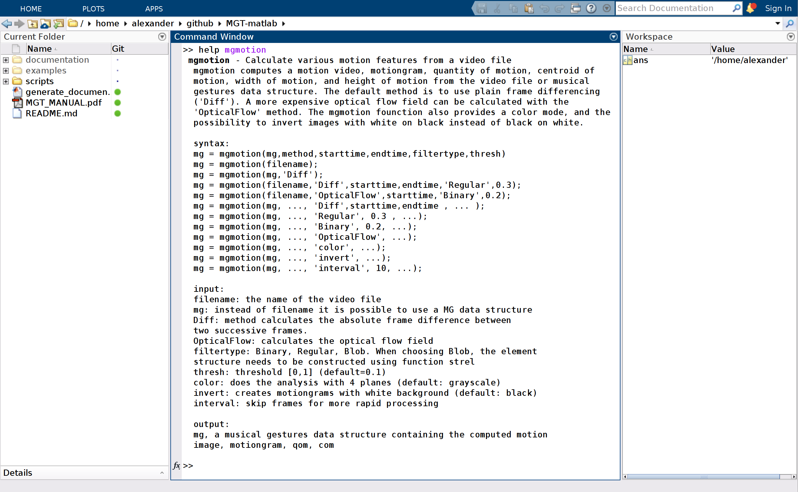

# Musical Gestures Toolbox for Matlab

The Musical Gestures Toolbox (MGT) is a Matlab toolbox for analysing music-related body motion, using sets of audio, video and motion capture data as source material.

It was primarily developed for music research, with a particular focus on studying the motion of musicians and dancers. But it can be used for any type of motion-related analysis based on video recordings.

## Functions

The Musical Gestures Toolbox contains a set of functions for the analysis and visualization of video, audio, and mocap data. There are four categories of functions:

- Data input and edit functions
- Data preprocessing functions
- Visualization functions
- Middle and higher level feature extraction functions

## Tutorial

Please refer to the [wiki pages](https://github.com/fourMs/MGT-matlab/wiki) for more information about installing and usage. Much of the same information is also available in the material for the software carpentry workshop [Quantitative Video analysis for Qualitative Research](https://alexarje.github.io/video-analysis-workshop/).

## Dependencies

1. Many of the basic things work with a standard Matlab install, but to use all features you will also need these extra Matlab packages:

    - Computer Vision System Toolbox
    - Image Processing Toolbox

2. Some of the functions build on code from these third-party toolboxes:

    - [matlabPyrTools](https://github.com/LabForComputationalVision/matlabPyrTools/archive/master.zip)
    - [MoCap Toolbox](https://www.jyu.fi/hum/laitokset/musiikki/en/research/coe/materials/mocaptoolbox)
    - [MIRtoolbox](https://www.jyu.fi/hum/laitokset/musiikki/en/research/coe/materials/mirtoolbox).

## History

The toolbox builds on the [Musical Gestures Toolbox for Max](http://www.uio.no/english/research/groups/fourms/downloads/software/musicalgesturestoolbox/), which has been developed by [alexarje](https://github.com/alexarje) since 2004, and parts of it is currently embedded in the [Jamoma](http://www.jamoma.org) project.

A large chunk of the code was written by [benlyyan](https://github.com/benlyyan) as part of his [M.Sc. thesis](https://www.duo.uio.no/handle/10852/51118) at the University of Oslo.

There is now also a [Musical Gestures Toolbox for Python](https://github.com/fourMs/MGT-python) with more or less the same functionality.

The software is maintained by the [fourMs lab](https://github.com/fourMs) at [RITMO Centre for Interdisciplinary Studies in Rhythm, Time and Motion](https://www.uio.no/ritmo/english/) at the University of Oslo.

## Reference

If you use this toolbox for research purposes, please reference this publication:

- Jensenius, Alexander Refsum (2018). [The Musical Gestures Toolbox for Matlab](http://hdl.handle.net/10852/65559). Proceedings of the 19th International Society for Music Information Retrieval Conference, Late Breaking Demos Session. Paris, France.

## Credits

Main developers: [Alexander Refsum Jensenius](http://people.uio.no/alexanje) and [Bo Shou](https://github.com/benlyyan).

## License

This software is open source, and is shared with [The GNU General Public License v3.0](https://www.gnu.org/licenses/gpl-3.0.html).
